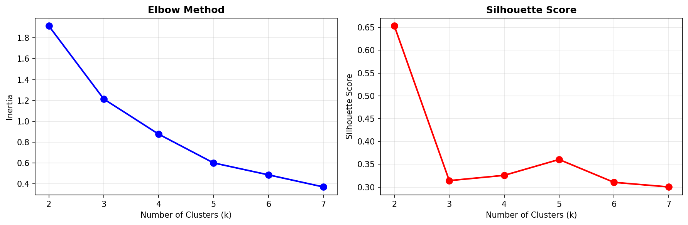
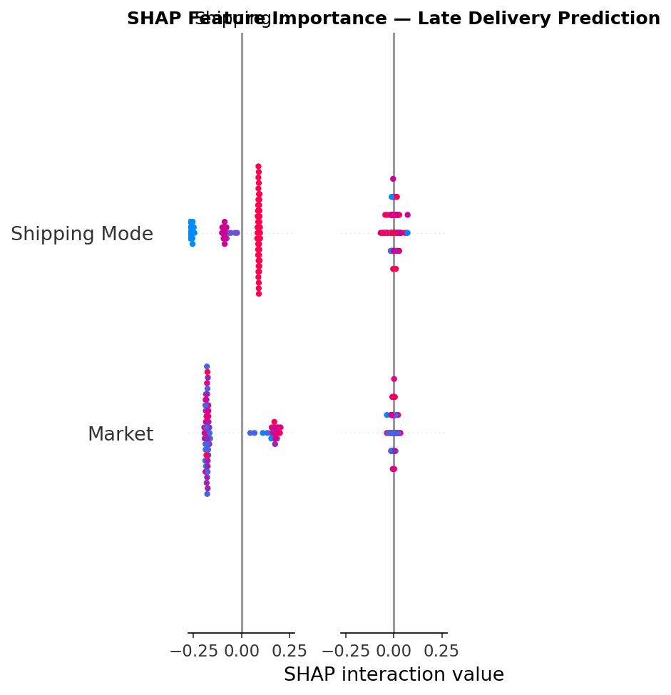
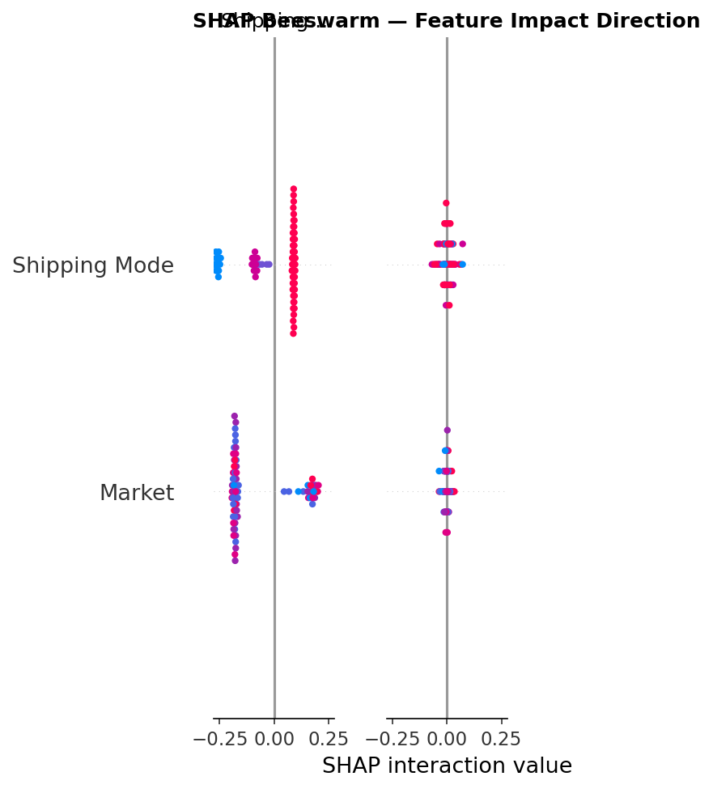
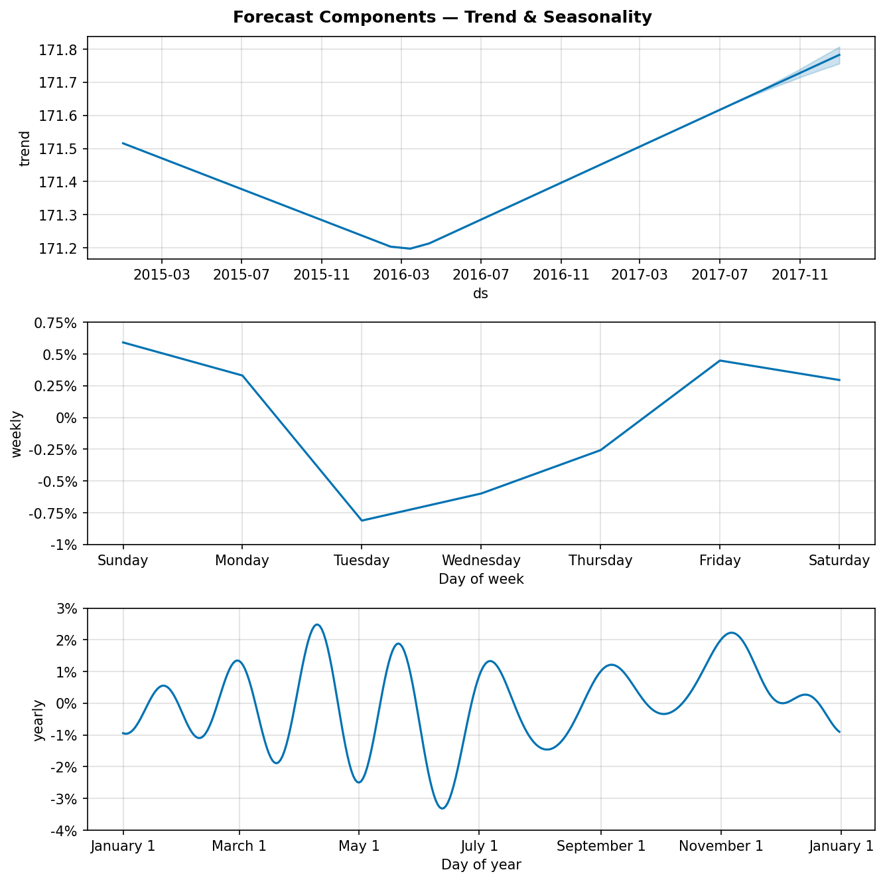
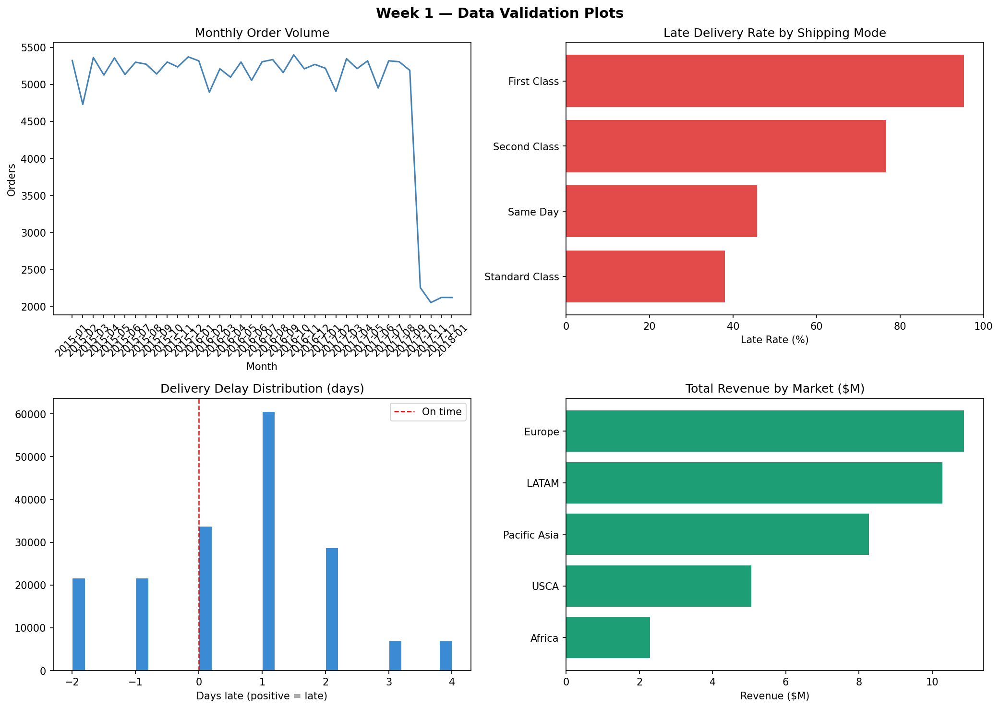

# 📦 Supply Chain Intelligence System

> **End-to-end data science project** — from raw transactions to a live Streamlit application covering late delivery prediction, supplier risk segmentation, demand forecasting, and business impact quantification.

<br>

## 🎬 Demo

[https://github.com/KirtanPatel18/supply-chain-intelligence/assets/demo.mp4](https://github.com/KirtanPatel18/supply-chain-intelligence/blob/main/assets/demo.mp4)

> *Full walkthrough of the 6-page Streamlit app*

---

## 🏆 Project Highlights

| Metric | Value |
|---|---|
| 📦 Orders Analysed | 180,519 |
| 💰 Total Revenue Analysed | $36.7M |
| ⚠️ Late Delivery Rate | 54.8% |
| 🔴 Revenue at Risk | $20.1M |
| 🤖 ML Model ROC-AUC | 0.741 |
| 📈 Forecast Accuracy | 92.8% |
| 💡 Orders Preventable | 25,813 |
| 💵 Net ROI of ML System | **1,874%** |

---

## 📊 Key Visualisations

### Supplier Risk Segmentation — Elbow & Silhouette


### SHAP Feature Importance — Why Orders Are Late


### SHAP Beeswarm — Feature Impact Direction


### Demand Forecast Components — Trend & Seasonality


### Data Validation — Week 1


### Interactive Charts (open in browser)

| Chart | File |
|---|---|
| Monthly Revenue & Orders | [`outputs/chart1_monthly_revenue.html`](outputs/chart1_monthly_revenue.html) |
| Late Rate by Shipping Mode | [`outputs/chart2_late_by_shipping.html`](outputs/chart2_late_by_shipping.html) |
| Delivery Performance | [`outputs/chart5_delivery_performance.html`](outputs/chart5_delivery_performance.html) |
| ML ROC Curves | [`outputs/chart_roc_curves.html`](outputs/chart_roc_curves.html) |
| Feature Importance | [`outputs/chart_feature_importance.html`](outputs/chart_feature_importance.html) |
| Supplier Risk Scores | [`outputs/supplier_risk_scores.html`](outputs/supplier_risk_scores.html) |
| Supplier Risk Bubble | [`outputs/supplier_risk_bubble.html`](outputs/supplier_risk_bubble.html) |
| 6-Month Demand Forecast | [`outputs/forecast_full.html`](outputs/forecast_full.html) |
| ROI Analysis | [`outputs/impact_roi_analysis.html`](outputs/impact_roi_analysis.html) |
| Revenue at Risk | [`outputs/impact_revenue_waterfall.html`](outputs/impact_revenue_waterfall.html) |

---

## 🗂️ Project Structure

```
supply-chain-intelligence/
│
├── app/
│   └── app.py                               # Streamlit app (6 pages)
│
├── notebooks/
│   ├── week1_data_cleaning.ipynb            # Data cleaning & feature engineering
│   ├── week2_eda.ipynb                      # EDA — 11 interactive charts
│   ├── week3_late_delivery_prediction.ipynb # ML model + SHAP explainability
│   ├── week4_supplier_risk_segmentation.ipynb # K-Means risk clustering
│   ├── week5_demand_forecasting.ipynb       # Prophet time-series forecast
│   ├── week6_business_impact.ipynb          # ROI & business impact
│   └── week7_powerbi_guide.md               # Power BI dashboard guide
│
├── data/
│   ├── raw/                                 # ⚠️ Not included — see setup
│   └── processed/                           # Generated CSVs from notebooks
│
├── models/                                  # Saved ML models (.pkl)
├── outputs/                                 # Charts (HTML + PNG)
├── assets/
│   └── demo.mp4                             # Streamlit app demo video
└── README.md
```

---

## 🔬 Week-by-Week Breakdown

### Week 1 — Data Cleaning & Feature Engineering
- Loaded 180,519 raw transactions with `latin-1` encoding
- Removed PII columns, fixed date types, handled all nulls
- Engineered 12 new features: `Delivery_Delay_Days`, `Is_Late`, `Revenue_At_Risk`, date parts
- **Key finding:** 54.8% of all orders are delivered late

### Week 2 — Exploratory Data Analysis
- 11 interactive Plotly charts saved to `outputs/`
- Revenue peaks in Q4 — clear seasonal demand pattern
- First Class shipping has surprisingly high late rate
- $20.1M revenue tied to late orders across all markets

### Week 3 — Late Delivery Prediction
- Trained 3 models: Logistic Regression, Random Forest, Gradient Boosting
- **Best model: Random Forest** — ROC-AUC: 0.741, Recall: 65.2%
- SHAP explainability — `Days for shipment (scheduled)` is #1 driver
- No data leakage — only features known at order placement used

### Week 4 — Supplier Risk Segmentation
- Risk profiles built for 23 supply regions across 5 global markets
- Composite Risk Score (0–100): Late Rate (40%), Avg Delay (25%), Cancel Rate (20%), Revenue at Risk (15%)
- K-Means k=3 → Low / Medium / High Risk tiers
- **Result:** 12 of 23 regions (52%) are High Risk — $11.7M revenue at risk from these alone

### Week 5 — Demand Forecasting
- Daily time series built from 180K+ transactions
- Facebook Prophet with yearly + weekly seasonality
- **Forecast accuracy: 92.8% (MAPE: 7.2%)** on 90-day holdout
- 6-month forecast: +6.2% demand growth, peak demand in December

### Week 6 — Business Impact & ROI
- Quantified cost of late deliveries across 4 categories
- ML intervention model: 25,813 orders preventable
- **Total savings: $1,224,132**
- **Net ROI: 1,874%** on $62,000 implementation cost

---

## 🖥️ Streamlit App — 6 Pages

| Page | What It Shows |
|---|---|
| 📊 Overview | Revenue KPIs, monthly trend, market breakdown, top categories |
| 🚚 Late Delivery Analysis | Late rate by shipping mode, region, monthly trend, delay distribution |
| ⚠️ Supplier Risk | Risk score chart, bubble chart, revenue at risk, full scorecard table |
| 📈 Demand Forecast | Full forecast with confidence interval, 6-month summary |
| 💰 Business Impact | Cost breakdown, ROI bar chart, executive summary table |
| 🔮 Late Delivery Predictor | Live prediction with risk gauge + business recommendations |

---

## 🛠️ Tech Stack

| Category | Tools |
|---|---|
| Language | Python 3.11 |
| Data Processing | Pandas, NumPy |
| Machine Learning | Scikit-learn (Random Forest, Logistic Regression, Gradient Boosting) |
| Explainability | SHAP |
| Forecasting | Facebook Prophet |
| Visualisation | Plotly, Matplotlib, Seaborn |
| Web App | Streamlit |
| Dashboard | Power BI |
| Version Control | Git, GitHub |

---

## ⚙️ Setup & Installation

### 1. Clone the repository
```bash
git clone https://github.com/KirtanPatel18/supply-chain-intelligence.git
cd supply-chain-intelligence
```

### 2. Install dependencies
```bash
pip install pandas numpy scikit-learn plotly streamlit prophet shap matplotlib seaborn
```

### 3. Download the dataset
Download **DataCo Smart Supply Chain** from Kaggle:
👉 [https://www.kaggle.com/datasets/shashwatwork/dataco-smart-supply-chain-for-big-data-analysis](https://www.kaggle.com/datasets/shashwatwork/dataco-smart-supply-chain-for-big-data-analysis)

Place it at:
```
data/raw/DataCoSupplyChainDataset/DataCoSupplyChainDataset.csv
```

### 4. Run notebooks in order
```
week1_data_cleaning.ipynb
week2_eda.ipynb
week3_late_delivery_prediction.ipynb
week4_supplier_risk_segmentation.ipynb
week5_demand_forecasting.ipynb
week6_business_impact.ipynb
```

### 5. Launch the Streamlit app
```bash
cd app
python -m streamlit run app.py
```

---

## ⚠️ Large Files Not Included

Due to GitHub's 100MB file size limit, these files are excluded:

| File | Size | How to Generate |
|---|---|---|
| `data/raw/` | 93MB | Download from Kaggle (link above) |
| `data/processed/cleaned_supply_chain.csv` | 72MB | Run `week1_data_cleaning.ipynb` |
| `models/late_delivery_model.pkl` | 638MB | Run `week3_late_delivery_prediction.ipynb` |
| `models/rf_late_delivery_model.pkl` | 638MB | Run `week3_late_delivery_prediction.ipynb` |

---

## 💼 Executive Summary

```
════════════════════════════════════════════════════════════
  SUPPLY CHAIN INTELLIGENCE — RESULTS
════════════════════════════════════════════════════════════
  Total Revenue          : $36,784,735
  Revenue at Risk        : $20,126,395  (54.8%)
  Late Delivery Rate     : 54.8%
  High Risk Regions      : 12 / 23  (52%)

  ML Model ROC-AUC       : 0.741
  Forecast Accuracy      : 92.8%
  Orders Preventable     : 25,813

  Total Savings (ML)     : $1,224,132
  Implementation Cost    : $62,000
  NET ROI                : 1,874%
════════════════════════════════════════════════════════════
```

---

## 👤 Author

**Kirtan Patel**
- GitHub: [@KirtanPatel18](https://github.com/KirtanPatel18)

---

## 📄 License

This project is open source and available under the [MIT License](LICENSE).

---

> *Built as a portfolio project demonstrating end-to-end data science skills — from raw supply chain data to a deployed application with quantified business impact.*
